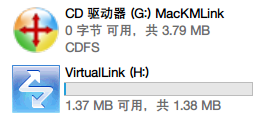
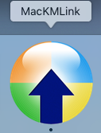
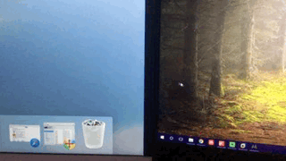
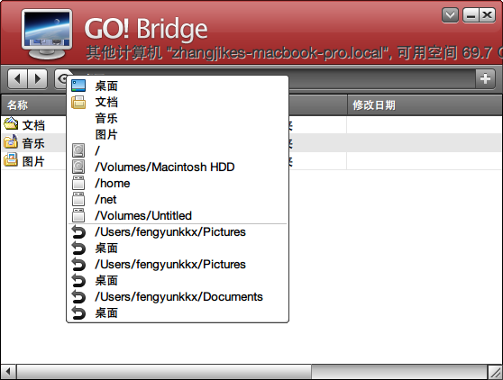
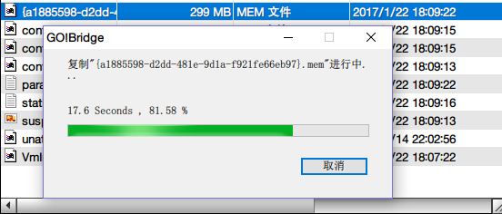

# 如果你有两台电脑需要连接，那你一定会爱上这根数据线

@([C09] 少数派首页已发布)

## 同时使用双设备的烦恼

在我身边有两台电脑，一台是 Windows 系统的 Alienware 15 笔记本电脑，另一台是老款的 Macbook Pro。

由于 Macbook 性能的原因，我的主力电脑是 Windows 系统的笔记本。因为配置较高，我更愿意使用它来完成我的一些日常工作，比如使用 Photoshop 处理图片、使用 Vegas 处理视频，又比如 Mac 上无法玩到的守望先锋。

而 MacOS 上又有一些优秀的独占应用，比如 [Notability](https://sspai.com/post/28061) 和 Day One，前者可以跟 iPad 结合，同步我所有的笔记，后者可以记录生活。而且在 Windows 上几乎找不到替代方法。

两者我都不愿意舍弃。

但是麻烦来了，由于两台电脑之间是完全独立的个体，如果我同时想用两台电脑，我就不得不在两个键盘和两个鼠标之间进行切换。并且还需要一个 U 盘进行文件的拷贝（使用网盘的传输速度不够稳定，且影响正常使用时的网速）。此外，在使用快捷键方面也很精分，时常会在 Ctrl 键和 Command 键之间犹豫，十分影响效率和心情。

## 一根数据线就能解决？

我尝试在网上搜索相关的解决方法，在知乎上看到了一个类似的提问。最高赞的回答表示一款来自日本的数据互拷线，可以解决这个问题。我十分兴奋的去日本亚马逊进行搜索。但是遗憾的是这款数据线的价格，299元，还要算上国际邮费和税收，这远远超出了我的预期。

所以我一度感到遗憾，这样神奇的一根数据线无法为我所用。

直到万能的淘宝给我推荐了这样一根数据线，价格仅需 39-99 元。为避免打广告嫌疑，具体品牌不做介绍。关键词是「对拷线」，感兴趣的可以自行搜索。

我看到后立刻入手了这根数据线，并且经过我的实际测试，这根数据线给了我极大的惊喜。

## 用一套键鼠就能控制两台电脑

接下来就要请介绍今天的主角了。

这根数据线其貌不扬，两头都是 USB 2.0 的公头，一头的体型比较宽大，其中应该内置了 Mac 和 Win 两个版本的驱动软件。

我用它连接了 Mac 和 Windows 电脑，在 Windows 端会自动启动一个名为「Mac KM Link」的驱动软件。并在电脑中显示为光驱和 U 盘。

在 Mac 端，也会显示连接了一个 U 盘，但是需要手动将其打开并安装一个应用程序。

两边都安装完驱动，然后把鼠标移动到屏幕的边缘，然后就……穿过去了！

WOW！

那种曾在双屏幕、虚拟机下才能体会到的「跨越屏幕」的快感，通过这根对拷线再一次实现了。

然后我尝试输入文字，连接在 Windows 电脑上的键盘，在 Mac 下可以 0 延迟的输入，鼠标的操作也没有任何的延迟。简直就像直接连接在 Mac 一样。如果不喜欢直接穿过，还可以设置为「快捷键切换」（默认快捷键为 Alt + s），也可以设置为「鼠标中键切换」

这既不是虚拟机，也不是双屏，这是真正的用一套键盘鼠标，在两台电脑上进行操作。

## 强大的 GO!Bridge

最强大的功能当属 GO!Bridge 功能了，这是驱动程序内置的功能，用于两台设备之间传输数据。

以 Mac 端为例，打开 GO!Bridge ，便可以在 Mac 上看到 Windows 电脑下所有的文件。包括其修改日期、文件大小。常用的「桌面」、「文档」等位置都有入口。

相比之下，Windows 端的 GO!Bridge 的界面显得有些简陋，但是功能类似。

## 令人满意的传输速度

这个小标题可能还需要加一个括号：「对于 USB 2.0 而言」。

由于 GO!Bridge 采用了独立的复制界面，我们无法看到具体的速度。经过不严谨的测试，300 MB 的单个文件用时 20 秒左右，相当于是 15 MB/s ，在 2.0 下达到这个速度已经足够应付日常使用了。

毕竟如果使用 U 盘，写入和读出都需要花费一定的时间，还会受限于 U 盘的容量。

当然，如果你认为传输速度不够理想，还可以去日本亚马逊官网上查找 USB 3.0 的对拷线信息，印象中的价位在 400-500 之间，国际运费 + 税费另算。

## 剪贴板共享，以及方便的操作

除了用一套键鼠，两台设备之间还可以共享剪贴板。我在 Mac 上复制一段内容，在 Windows 电脑上粘贴。还支持拖动操作。直接在两台电脑之间进行文件拷贝。

在插上这根对拷线后，两台电脑似乎组成了一个双屏，区别只是无法将窗口拖到另一台电脑中。数据和键鼠的共享让这两台设备变成了一个整体，超低的延迟也让整个过程非常友好。

如果觉得这根数据线比较贵，也可以通过软件实现。据我所知，目前确实有一款软件可以达到类似的效果：Synergy。但是在我体验过这款软件之后，在电脑设置和权限方面都需要一定的条件，网络的稳定也会影响操作的流畅度。所以我在使用了几天之后放弃了这款软件。

数据对拷线算是很有用的外设了，很推荐有两台设备的用户购买使用（两台 Windows 电脑之间也可以连接使用）。但是由于小众，在国内鲜有相关的介绍，实在是可惜了这一神器。

如果你对它感兴趣，可以利用关键词「对拷线」在淘宝进行搜索。

本文由我撰写，首发于 [少数派](https://sspai.com/post/39444)
