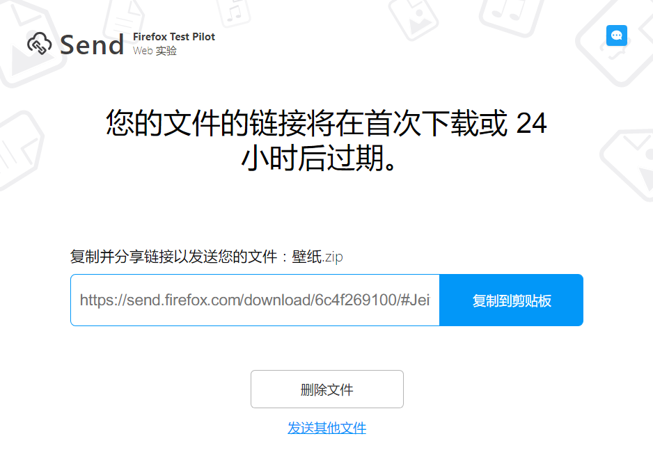

# Firefox Send ：属于文件的阅后即焚服务 | App+1

[Firefox Send](https://send.firefox.com) 是由火狐推出的一项实验性功能，它提供的是一种类似于阅后即焚的文件分享服务。

与其他实验性功能不同的是，它是一个 Web 页面。你不需要安装任何插件，就可以用任何浏览器访问它。而且允许用户上传很大的文件（最大为 1 GB），然后生成一个只允许一次下载的分享链接。

## 传输速度测试

我在相同的网络环境下进行了一次横向测试，上传一个 25.3 MB 的压缩包文件。分别在百度网盘、 Firefox Send、SendAnywhere 的网页版上进行了这次测试，测试浏览器为 Chrome。

- 百度网盘 网页版，耗时 56 秒，平均上传速度为  452 KB/s。

- SendAnywhere 网页版，耗时 1 分 09 秒，平均上传速度为 367 KB/s。

- Firefox Send，耗时 1 分 24 秒，平均上传速度为  301 KB/s。

传输速度与运营商的投入有着直接的关系。由于百度网盘是国内网站，在国内的服务器数量也远超 Firefox Send。

同时，Firefox Send 目前还只是一个实验性项目，所以传输速度稍慢也情有可原。

在上传完毕之后，Firefox Send 还会保留该设备「上传但是尚未分享」的历史记录，随时可以把这些文件发送给别人。

## 别具一格的阅后即焚-文件版

与其他「长期保留」的文件存储服务、具有「即时性」的文件传输服务不同，Firefox Send 创建的每个链接只允许 1 次下载，如果在 24 小时内没有任何下载，则文件过期，并会自动从 Send 的服务器中删除。

这样的链接通常是用于私人之间的单次分享，比如一些不适合公开的重要文件、私人照片。

如果你不想通过 QQ、微信传输，也不想上传到网盘（因为它们在传输和存储环节都有潜在的安全隐患）。甚至 SendAnywhere 也可能会在某一方的 App 中留下「历史记录」。

而当你使用 Firefox Send，基本可以做到「天知地知，你知我知」的程度。——双方使用的都是浏览器，文件的存储和传输是加密的，服务器的文件会在一次下载后自动删除。即使其他人查看浏览器的历史记录，网页上的文件记录也早已删的干干净净，无法追查。

而且，如果这些重要文件被泄露了，那一定就是对方干的好事。

其实 Firefox Send 不一定很实用，因为在大多数时候，我们并不需要经常使用到它。但这确实是一个很有意思的功能，为我们分享文件提供了一种新的方式。

如果你对它感兴趣，可以访问 [Firefox Send](https://send.firefox.com) 体验。
